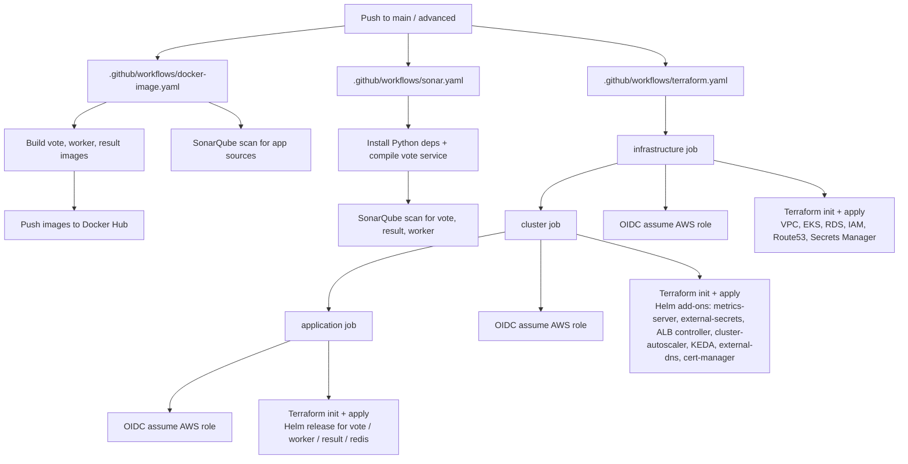
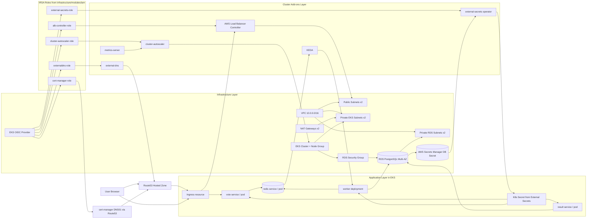

# Voting App –DevOps Project

Setup_project_2 has the cloud infrastructure with EKS

## Summary

This project takes the multi-service voting application (Vote, Redis, Worker,
Postgres, Result) and deploys it to **AWS EKS** using fully automated,
Terraform-managed infrastructure and a **Helm** chart, with the whole
lifecycle driven by **GitHub Actions**.

The stack is split into independent Terraform layers, each with its own
remote S3 state:

| Layer            | Purpose                                                                 |
| ---------------- | ------------------------------------------------------------------------ |
| `github-oidc`   | One-time, locally-applied setup of the AWS IAM OIDC trust so GitHub Actions can assume an AWS role without long-lived credentials. |
| `bootstrap`     | Creates the S3 bucket used for Terraform remote state (applied once, outside CI). |
| `infrastructure` | VPC, subnets/route tables, EKS cluster, RDS (Postgres), IAM, Route53, Secrets Manager. |
| `cluster`       | Cluster-level Helm add-ons: metrics-server, external-secrets, AWS Load Balancer Controller, cluster-autoscaler, KEDA, external-dns, cert-manager. |
| `application`   | The voting app itself, deployed as a single Helm release (`vote`, `worker`, `result`, `redis`, ingress, database wiring). |

Application autoscaling is handled by **KEDA**, which scales the `worker`
Deployment based on the length of the `votes` list in Redis, instead of a
static replica count.

## Pipeline Process

Three GitHub Actions workflows automate the project, all triggered on
`push` to `main`/`advanced`:

1. **`docker-image.yaml`** – Builds and pushes the `vote`, `worker`, and
   `result` Docker images to Docker Hub, and runs a SonarQube scan for code
   quality.
2. **`sonar.yaml`** – Runs a dedicated SonarQube analysis over the Python
   `vote` service and the `result`/`worker` sources.
3. **`terraform.yaml`** – Provisions/updates the AWS infrastructure in
   sequence, one job per layer:

   Each job:
   - Checks out the repo and installs Terraform (`hashicorp/setup-terraform`).
   - Authenticates to AWS via **OIDC** (`aws-actions/configure-aws-credentials`,
     assuming `AWS_ROLE_ARN` — no static AWS keys stored in GitHub).
   - Runs `terraform init` against the shared remote-state S3 bucket
     (`AWS_S3_BUCKET_NAME` secret).
   - Runs `terraform apply -auto-approve` for that layer, passing the state
     bucket name to downstream layers that need it (e.g. `cluster` and
     `application` reference the shared tfstate bucket for their own
     `terraform_remote_state` lookups).
   - `needs:` dependencies enforce the correct order — `cluster` waits for
     `infrastructure`, and `application` waits for `cluster` — since each
     layer reads outputs (VPC, EKS cluster, IAM roles, etc.) from the one
     before it via `terraform_remote_state`.

## Infrastructure to Application Interaction Flow

The chart below shows how resources provisioned in `infrastructure/` and
`cluster/` are consumed by runtime application components in
`application/`.

### Runtime Interaction Overview

1. Traffic path: users resolve the application domain in Route53, hit the
   ALB managed by the AWS Load Balancer Controller, and are routed through
   Kubernetes Ingress to the application services.
2. Vote ingestion path: the vote component writes incoming votes into Redis.
3. Processing path: the worker consumes votes from Redis and persists them to
   RDS PostgreSQL.
4. Read path: the result component reads aggregated data from RDS PostgreSQL
   and renders live totals.
5. Secret path: database credentials are stored in AWS Secrets Manager,
   synchronized into Kubernetes by external-secrets, and consumed by vote,
   worker, and result pods.
6. Scaling path: KEDA watches Redis queue depth and scales worker replicas;
   cluster-autoscaler adjusts node capacity when pod scheduling pressure
   increases.
7. Control-plane identity path: IAM roles for add-ons are assumed through
   IRSA, using the EKS OIDC provider and service-account-scoped trust.

### Required GitHub Secrets
On top of all the variables inside of .tfvars (which do not exist in the repo and is intended practice), you also need the following ones.
On the other hand, this missing .tfvars also means the pipeline for application deployment will not finish and only be waiting to get the variables.
| Secret               | Purpose                                      |
| --------------------- | --------------------------------------------- |
| `AWS_ROLE_ARN`       | IAM role assumed via OIDC for all Terraform jobs. |
| `AWS_S3_BUCKET_NAME` | Name of the pre-created Terraform state bucket. |
| `DOCKERHUB_USERNAME` / `DOCKERHUB_TOKEN` | Docker Hub push credentials. |
| `SONAR_TOKEN` / `SONAR_HOST_URL` | SonarQube analysis. |

### One-time manual steps (outside CI)

- Apply `github-oidc/` once, locally, to create the IAM role/OIDC trust
  GitHub Actions assumes.
- Apply `bootstrap/` once, locally, to create the S3 state bucket, then
  store its name in the `AWS_S3_BUCKET_NAME` secret.

After these one-time steps, every subsequent push re-applies
`infrastructure` → `cluster` → `application` automatically.
